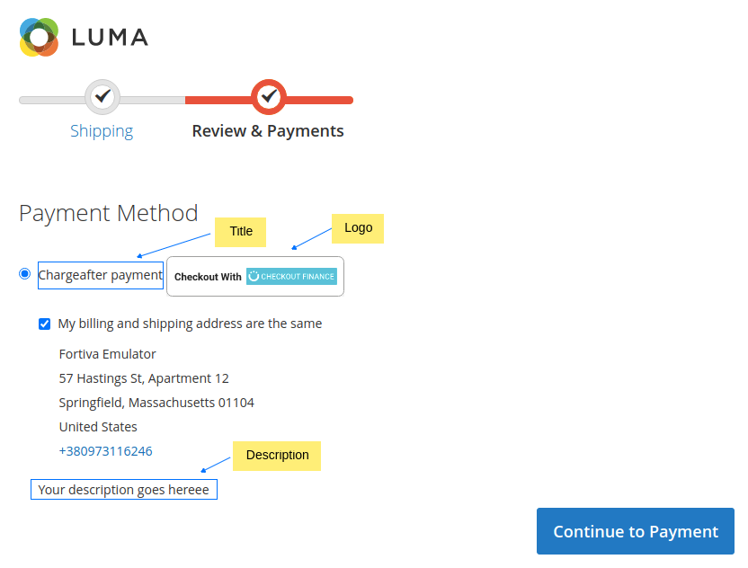
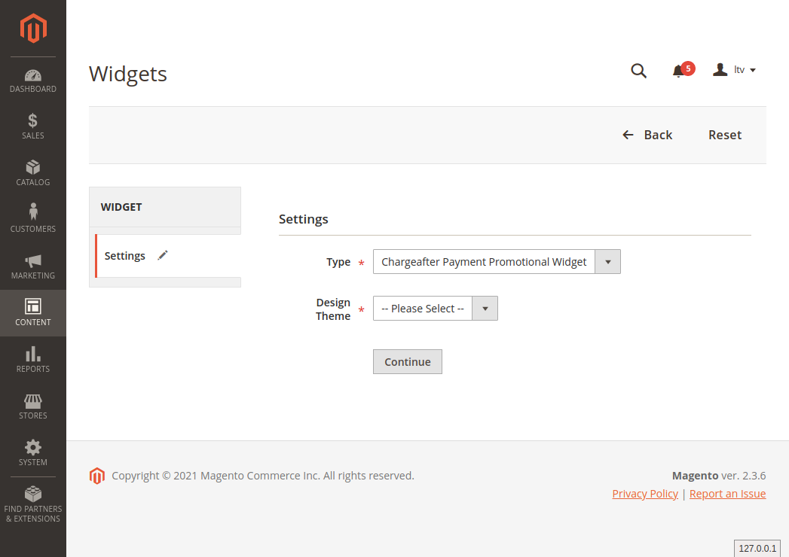

# chargeafter-magento2-module-payment
## Magento 2 install extension using command line

Your Magento 2.x extensions can be installed in a few minutes by going through these following steps:

1. Download/purchase the extension (like zip or tar.gz archive)
2. Login to your Magento 2.x Hosting site using SSH connection (for details contact your hosting provider)
3. After successful SSH login, using the command line (shell), open the Magento root directory where Magento 2.x is installed
4. Create directory app/code/Chargeafter/Payment:
    - `mkdir –p app/code/Chargeafter/Payment`
5. Upload Extension (as Zip or tar.gz) to your Magento 2.x installation root directory
6. Unzip Extension file in directory app/code/Chargeafter/Payment:
    - `unzip package.zip -d  app/code/Chargeafter/Payment`
7. Remove  Extension file from  Magento 2.x installation root directory:
    - `rm  package.zip`
8. Run the Magento 2.x install command from root:
    - `php bin/magento setup:upgrade`
9. The module should now be installed and visible:
    - `php bin/magento module:status Chargeafter_Payment`
## Magento 2 extension configuration

1. Login to the Magento 2 Admin Dashboard
2. Go to Store > Configuration > Sales > Payment Methods.
3. All installed payment methods will appears in this section.
4. Click on OTHER PAYMENT METHODS section and click "Configure" button and update the following configurations.  

|Settings                          |Description                                                                                                                                          |Default                     |
|----------------------------------|-----------------------------------------------------------------------------------------------------------------------------------------------------|----------------------------|
|**Base Settings**                 |                                                                                                                                                     |                            |
|Enable this Solution              |Once you completed the configuration, Enable Charge After as a payment method. If it is set to ‘yes’, it will appear on Checkout Page.               |No                          |
|Title                             |The payment method title that you will see in your checkout page.                                                                                    |'Chargeafter payment'       |
|Description                       |The payment method description that appears in the checkout below the payment method title.                                                          |'Your description goes here'|
|Logo                              |The payment method logo that you will see in your checkout page.                                                                                     |No Image                    |
|Payment from applicable countries |Restrict the payment method to specific countries.                                                                                                   |All Allowed Countries       |
|Sort Order                        |The order in which this payment method is displayed in the list of payment methods in the checkout. To change order, enter any number greater than 0.|Empty                       |
|**API Settings**                  |                                                                                                                                                     |                            |
|Mode/Environment                  |This is the environment that you are using. If you are in testing mode, use ‘Sandbox’ and if in live mode use ‘Production’.                          |Sandbox                     |
|Production Private API Key|Your private production key. Provided by ChargeAfter.                                                                                                        |Empty                       |
|Production Public API Key|Your public production key. Provided by ChargeAfter.                                                                                                          |Empty                       |
|Sandbox Private API Key|Your private sandbox key. Provided by ChargeAfter.                                                                                                              |Empty                       |
|Sandbox Public API Key|Your public sandbox key. Provided by ChargeAfter.                                                                                                                |Empty                       |

## Creating a Widget

The process of creating a widget is nearly the same for each widget type. You can follow the first part of the instructions, and then complete the last part for the specific type of widget you want.

### Step 1: Choose the type

1. On the Admin sidebar, go to Content > Elements > Widgets.
2. Click `Add Widget`.
3. In the Settings section:
    - Set Type to the widget type - "Chargeafter Payment Promotional Widget"
    - Verify that Design Theme is set to the current theme.

4. Click `Continue`.

### Step 2: Specify storefront properties and layout

1. In the Storefront Properties section:
    - For Widget Title, enter a descriptive title for the widget.  
      This title is visible only from the Admin.
    - For Assign to Store Views, select the store views where the widget will be visible.  
      You can select a specific store view, or All Store Views. To select multiple views, hold down the Ctrl key (PC) or the Command key (Mac) and click each option.
    - (Optional) For Sort Order, enter a number to determine the order this item appears with others in the same part of the page. (0 = first, 1 = second, 3 = third, and so on.)

2. In the Layout Updates section, click `Add Layout Update`.
3. Set Display On to the type of page where it is to appear.
4. In the Container list, choose the area of the page layout where it is to be placed.

   
### Step 3: Complete the widget options

1. In the left panel, choose Widget Options.
2. Choose **Type**
    - **product-widget**  
    
      
    - **product-widget-line-of-credit**  
    
      
    - **product-widget-installments**  
      *Or $34/month for 36 months. Learn More*
      
    - **textual**  
      *Pay as low as $45.99 a month. Buy with ChargeAfter*
      
    - **banner-horizontal**
    
      
    - **banner-vertical**  
    
      
